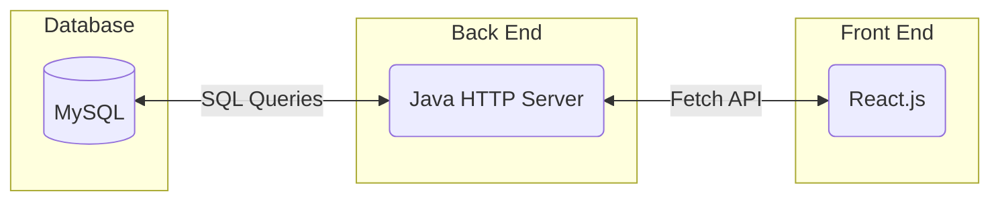
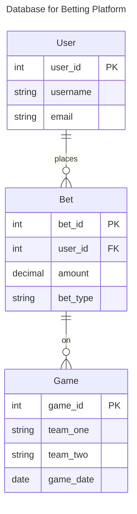
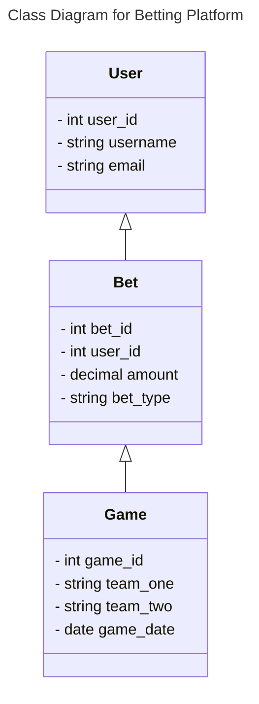
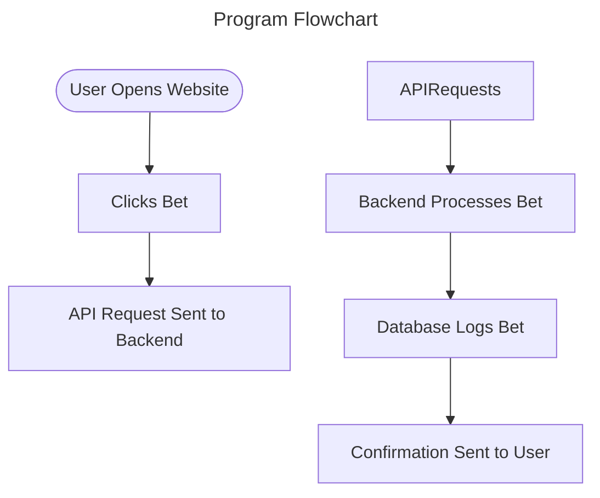
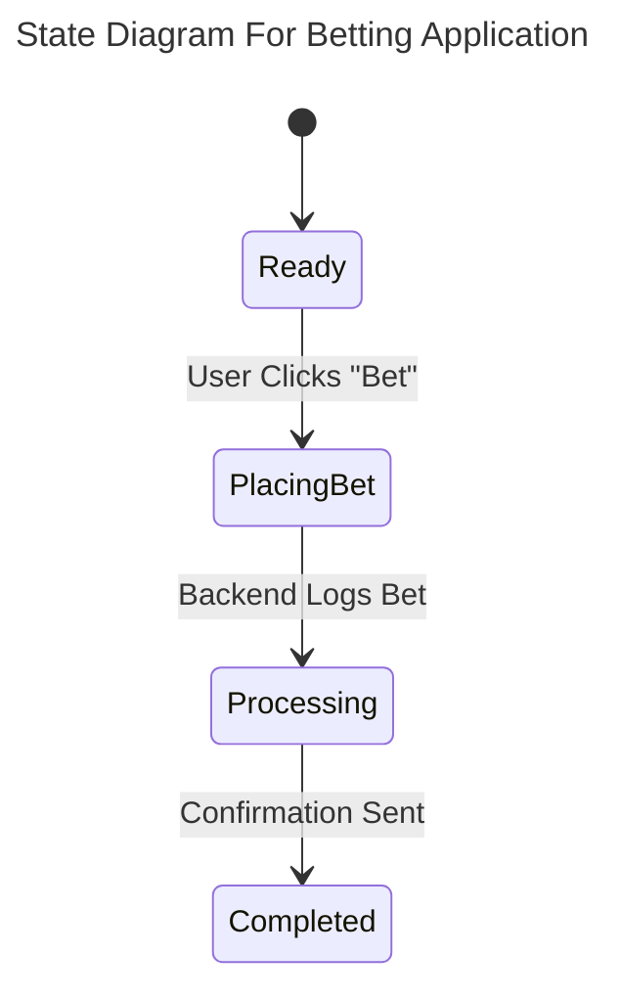
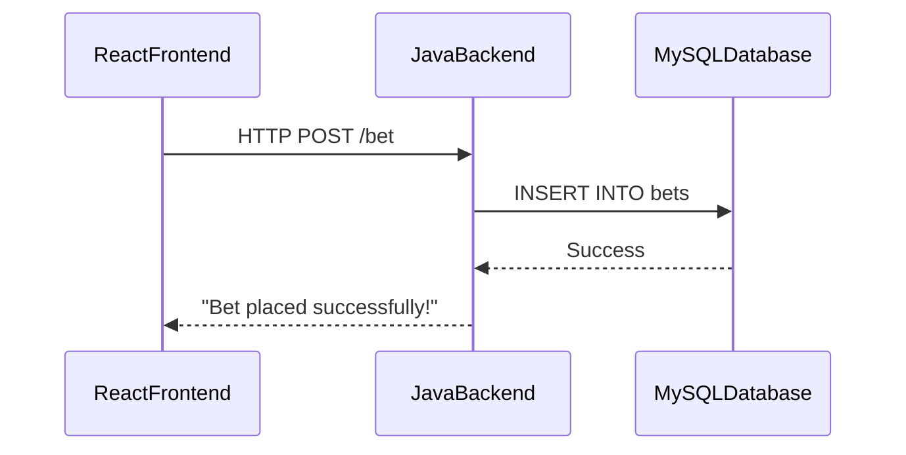

# Specification Document

This document serves as a living reference for the March Madness Betting Platform. It will be updated regularly to reflect changes in project architecture, specifications, and development decisions.

## Team Name

T_23

## Project Abstract

The March Madness Betting Platform allows users to place bets on tournament games through a user interface. The system consists of a React.js frontend, a Java HTTP backend, and a MySQL database that stores betting data. Users submit bets which are logged and retrievable. Future enhancements include authentication, game tracking, expanded bet types, and user profiles.

## Customer

This software is designed for:

* Casual March Madness fans who want to participate in friendly betting
* Betting enthusiasts seeking a lightweight betting platform
* Instructional staff from CS506

---

## Installation

To set up the project on your local machine, ensure the following tools are installed.

### Required Tools

**Docker Desktop**
Download and install from:
[https://www.docker.com/products/docker-desktop/](https://www.docker.com/products/docker-desktop/)

**Git**
Download and install from:
[https://git-scm.com/downloads](https://git-scm.com/downloads)

---

## Cloning the Repository

Clone the project onto your machine:

```bash
git clone https://github.com/glitch418/MarchMadnessBettingPlatform.git
cd MarchMadnessBettingPlatform/
```

Ensure Docker Desktop is running before continuing.

Start Docker Desktop on macOS:

```bash
open -a Docker
```

---

## Running the Project

Use Docker Compose to start all services such as the frontend, backend, MySQL database, and phpMyAdmin.

### Start all services

```bash
docker compose up -d
```

### Rebuild and start (if you updated Dockerfiles)

```bash
docker compose up --build -d
```

### Verify containers are running

```bash
docker ps
```

Expected containers:

* backend
* frontend
* db
* phpmyadmin2

---

## Stopping the Project

To stop all running services:

```bash
docker compose down
```

To stop services and remove volumes (for example, to reset the database):

```bash
docker compose down -v
```

---

## Running the Project Locally (Without Docker)

If you wish to run components individually without Docker:

### Frontend (React)

```bash
cd Frontend
npm install
npm run dev
```

The frontend will run at:
[http://localhost:3000](http://localhost:3000)

### Backend (Java)

Ensure you have **JDK 17** installed.

```bash
javac -cp ".:mysql-connector-java.jar:gson.jar" BackendMain.java
java -cp ".:mysql-connector-java.jar:gson.jar" BackendMain
```

The backend will run at:
[http://localhost:5001](http://localhost:5001)

MySQL must be running separately if Docker is not used.

---

## Service Ports

Below are the default ports used by each service when running through Docker Compose:

* **Frontend** (React + Nginx): [http://localhost:3000](http://localhost:3000) → container port 80
* **Backend** (Java HTTP server): [http://localhost:5001](http://localhost:5001) → container port 5001
* **MySQL Database**: localhost:3306 → container port 3306
* **phpMyAdmin**: [http://localhost:50082](http://localhost:50082) → container port 80

These values can be modified in `docker-compose.yml` if needed.

---

## Specification

### Technology Stack



### Database



### Class Diagram


### Flowchart



### Behavior



### Sequence Diagram



### Standards & Conventions

<!--This is a link to a seperate coding conventions document / style guide-->
[Style Guide & Conventions](STYLE.md)
